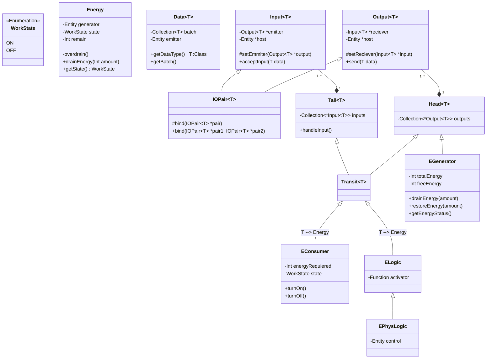

```mermaid
classDiagram
	class WorkState{
		<<Enumeration>>
		ON
		OFF
	}
    class Energy {
        -Entity generator
        -WorkState state
        -Int remain
        -overdrain()
        +drainEnergy(Int amount)
        +getState() WorkState
    }
    class Data~T~{
        -Collection~T~ batch
        -Entity emitter
        +getDataType() T::Class
        +getBatch()
    }
	class Output~T~{
		-Input~T~ *reciever
		-Entity *host
		#setReciever(Input~T~ *input)
		+send(T data)
	}
	class Input~T~ {
		-Output~T~ *emitter
		-Entity *host
		#setEmmiter(Output~T~ *output)
		+acceptInput(T data)
	}
    class IOPair~T~{
        #bind(IOPair~T~ *pair)
        +bind(IOPair~T~ *pair1, IOPair~T~ *pair2)$
    }
	class Head~T~ {
		-Collection~*Output~T~~ outputs
	}
	class Tail~T~ {
		-Collection~*Input~T~~ inputs
		+handleInput()
	}
	class Transit~T~ {
	}


	class EGenerator {
		-Int totalEnergy
		-Int freeEnergy
		+drainEnergy(amount)
		+restoreEnergy(amount)
		+getEnergyStatus()
	}
	class EConsumer {
		-Int energyRequiered
		-WorkState state
		+turnOn()
		+turnOff()
	}
	class ELogic {
		-Function activator
	}
	class EPhysLogic{
		-Entity control
	}


	Input <|-- IOPair
	Output <|-- IOPair
	Input "1..*" --* "1" Tail
	Output "1..*" --* "1" Head

	Tail <|-- Transit

	Head <|-- Transit
	Head <|-- EGenerator

	Transit <|-- EConsumer : T --> Energy
	Transit <|-- ELogic : T --> Energy

	ELogic <|-- EPhysLogic
```